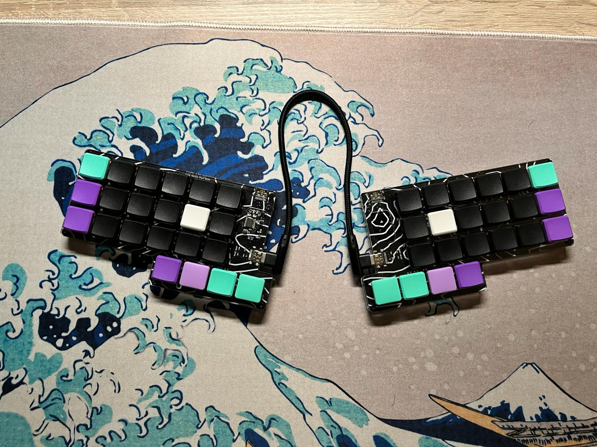
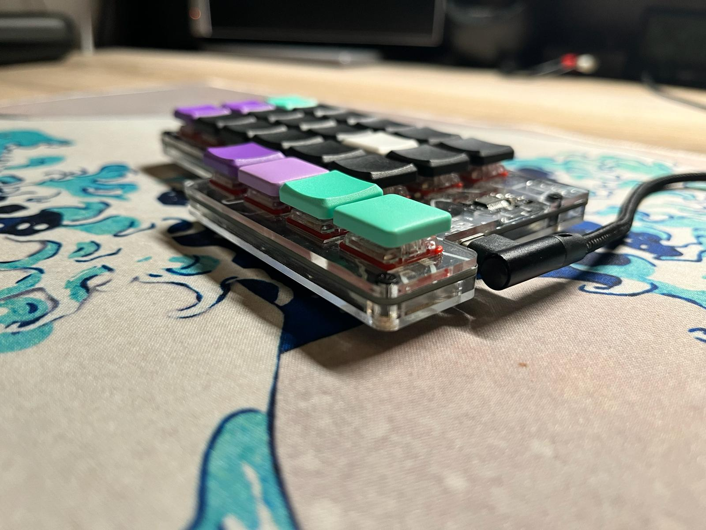
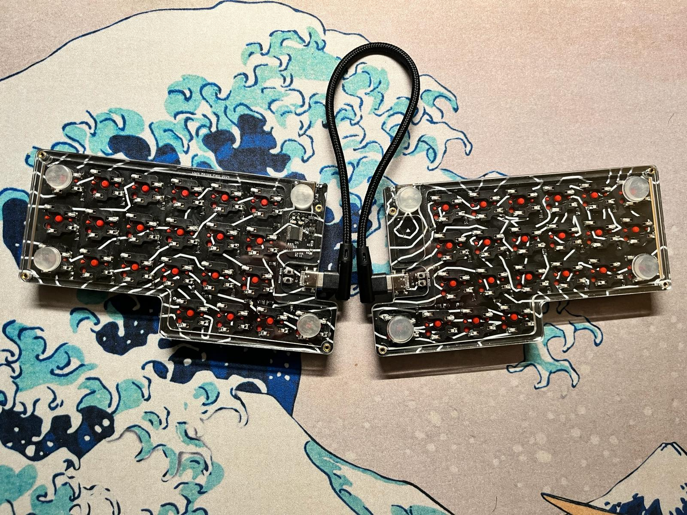
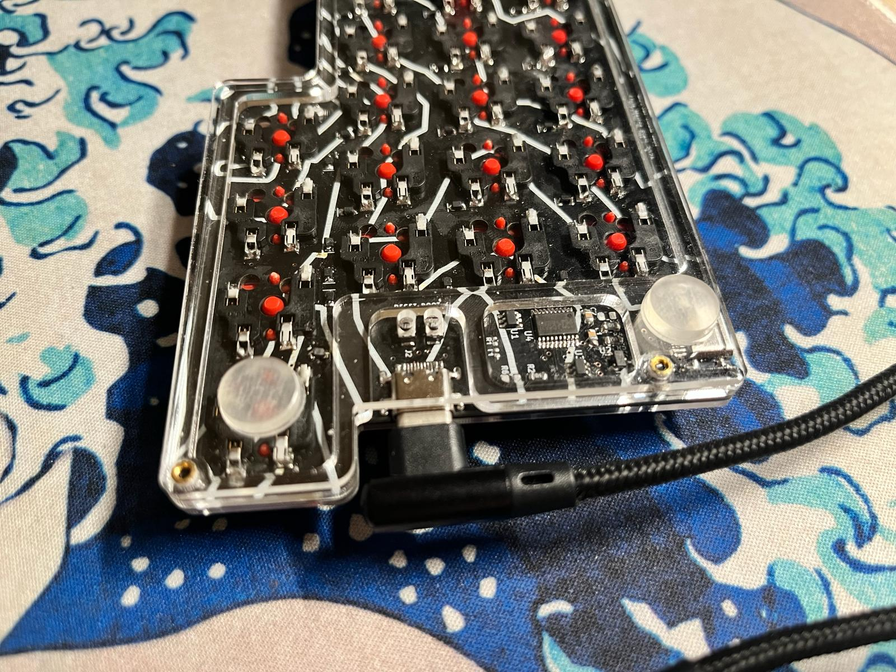
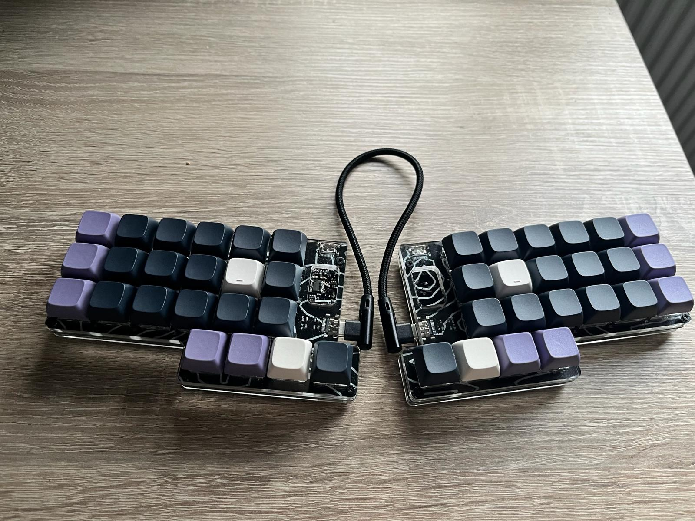
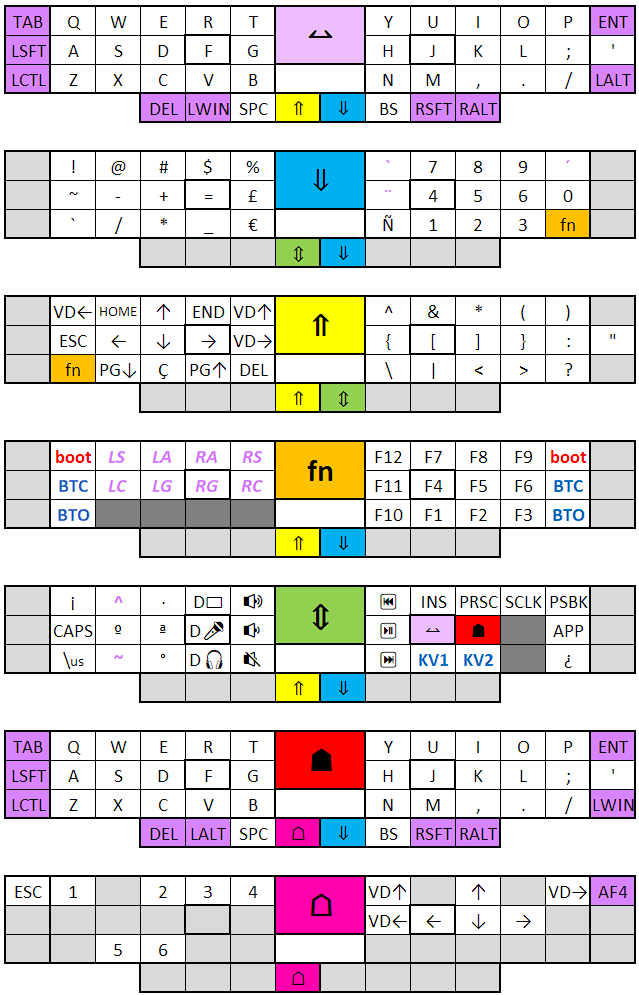

# PICCTRL - 0xPM
## 3x6 + 4 Split Ortholinear Keyboard with on board MCU

## Characteristics:
* [FAK](https://github.com/semickolon/fak) powered
* CH552
* ESD, over-current, short-circuit, reverse polarity protection.
* [Acrylic case](https://github.com/llmerlos/OxPM/PCB/svgs).
* Reversible PCB
* MX and Choc V1 compatibility.

### Choc V1

### MX

### Keymap
Nickel files available [here](https://github.com/llmerlos/OxPM/firmware/).

